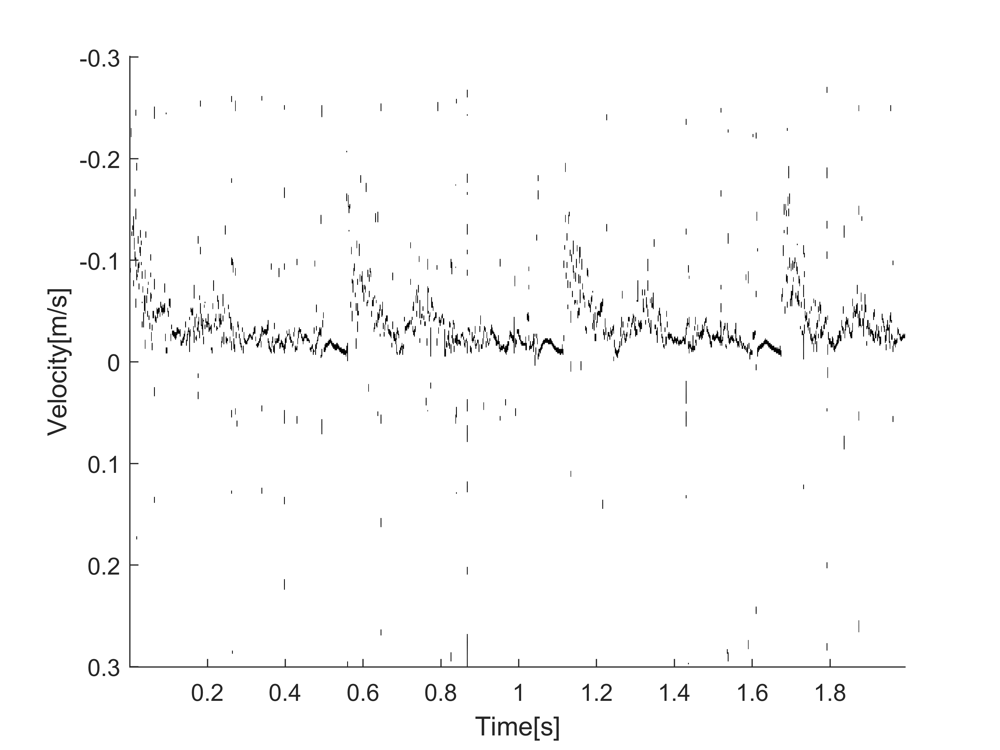

# 人体血流速度测试实验

本项目旨在利用Sonix设备进行人体血流速度测试，通过开源该项目，帮助更多科研人员进行相关测试和研究。

## 目的

本实验的目的是通过使用Sonix设备测量和分析劲动脉血流速度，提供可靠的数据支持，促进血流速度估计在医学等领域研究中的应用和发展。

## 实验设备

本实验使用能收发单个频率多普勒脉冲的机器，通过在连续时间中对同一探测部位分别发射不同中心频率的单频多普勒脉冲以获得多频采样数据。
实验采用Ultrasonix公司的Sonix RP设备如下图所示：

### 图1 实验设备

## 实验过程
实验对象为24岁的健康青年男子，在其静止的状态下使用PW模式测量颈动脉的回波数据。首先设定入射深度为4cm，采样门长度为1mm，入射角度为52度，脉冲重复频率为4KHz，采样频率为20MHz。
然后设定探头发射频率为5MHz，测量颈动脉，得到长度为30000帧的回波数据data f1；在获得数据的连续时间后设定发射频率为6.6MHz，对同一部位进行测量，得到长度为30000帧的回波数据data f2。
将data f1和data f2在最大速度处对齐，并各自截取8000帧，得到.MAT格式的多频回波数据data1，快拍数Q=24。
为了测量多组数据，我们在不同时间对同一名男子的颈动脉再次进行测量，更改采样门长度为2mm以增加快拍数量，其余参数与第一次测量相同。
重复第一次实验的步骤得到.MAT格式的多频回波数据data2，快拍数Q=50。
Sonix RP的相关参数总结于表1。
在血流速度估计前，需要对血管壁和组织反射产生的低频杂波成分进行滤波，此处采用巴特沃斯高通滤波器，截至频率设定为80Hz，然后进行Hilbert变换。
由于换能器的波束发射方向与血液流向间存在夹角，因此对回波直接进行估计得到的是真实速度在夹角方向上的分量，在最后需要通过除以夹角的余弦以获得正确的血流速度，根据实验参数夹角为52度。

### 表1 Sonix RP参数
| 参数            | 量值（单位）                 |
| --------------- | ---------------------------- |
| 超声探头        | L9-4/38 线性探头             |
| 探头发射频率    | 5MHz（data1），6.6MHz（data2）|
| 入射深度        | 4cm                         |
| 采样门长度      | 1mm（data1），2mm（data2）   |
| 入射角度        | 52°                         |
| 脉冲重复频率    | 4KHz                        |
| 采样频率        | 20MHz                       |
| 截取帧数        | 8000                        |
| 快拍数          | 24（data1），50（data2）     |

## 实验数据处理
正在编写...

## 上传实验数据说明
正在编写...

## 实验效果说明与展示

对于实验的到的测试数据data1与data2中的.MAT文件可以直接用于血流速度测试。
为对结果进行展示，本文利用经典血流速度估计方法BMUSIC进行血流速度估计，估计得到的血流速度谱如图2所示：

### 图2 血流速度谱

## 致谢

感谢在项目进行过程中给予帮助和支持的个人或组织。

---

如果你有任何问题或建议，请随时联系我。
